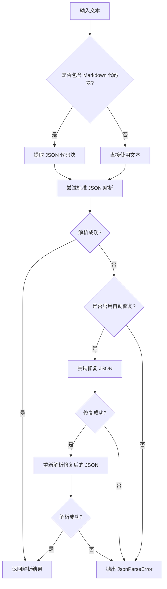

# Parser 模块设计文档

## 1. 功能描述

Parser 模块负责从 LLM 的非结构化输出中提取结构化数据。主要功能包括：

- **JSON 解析**: 从纯文本中提取和解析 JSON 数据
- **Markdown 代码块提取**: 从 Markdown 格式的文本中提取 JSON 代码块
- **容错处理**: 处理常见的 JSON 格式错误，提供基本的修复能力
- **错误报告**: 提供详细的解析错误信息，便于后续修正

## 2. 设计目标

1. **健壮性**: 能够处理各种格式的 LLM 输出，包括不规范的 JSON
2. **容错性**: 对常见的 JSON 格式错误有一定的修复能力
3. **可扩展性**: 支持未来添加 XML、YAML 等其他格式的解析器
4. **易用性**: 提供简洁的 API，便于集成到现有流程中

## 3. 接口设计

### 3.1 核心类：JsonParser

```python
class JsonParser:
    """健壮的 JSON 解析器，支持从 Markdown 代码块中提取和容错解析。"""
    
    def __init__(self, *, need_try_auto_repair: bool = True):
        """
        初始化 JSON 解析器
        
        Args:
            need_try_auto_repair: 是否尝试自动修复常见的 JSON 格式错误
        """
        
    def parse(self, text: str) -> Dict[str, Any]:
        """
        解析文本中的 JSON 数据
        
        Args:
            text: 包含 JSON 的文本（可以是纯 JSON 或 Markdown 代码块）
            
        Returns:
            解析后的字典数据
            
        Raises:
            JsonParseError: 当无法解析 JSON 时抛出
        """
        
    def extract_json_from_markdown(self, text: str) -> Optional[str]:
        """
        从 Markdown 文本中提取 JSON 代码块
        
        Args:
            text: Markdown 格式的文本
            
        Returns:
            提取出的 JSON 字符串，如果未找到则返回 None
        """
        
    def try_repair_json(self, json_str: str) -> str:
        """
        尝试修复常见的 JSON 格式错误
        
        Args:
            json_str: 可能有格式错误的 JSON 字符串
            
        Returns:
            修复后的 JSON 字符串
            
        Raises:
            JsonParseError: 当无法修复时抛出
        """
```

### 3.2 异常类：JsonParseError

```python
class JsonParseError(Exception):
    """JSON 解析错误异常"""
    
    def __init__(self, message: str, original_text: str, error_details: Optional[str] = None):
        """
        初始化解析错误
        
        Args:
            message: 错误消息
            original_text: 原始文本内容
            error_details: 详细的错误信息
        """
```

## 4. 核心功能实现

### 4.1 Markdown 代码块提取

支持以下 Markdown 代码块格式：

```markdown
```json
{"name": "John", "age": 30}
```

```json
{"name": "John", "age": 30}
```

使用正则表达式进行模式匹配：
- ````json\s*\n([\s\S]*?)\n```\s*````
- ````json\s*\n([\s\S]*?)\n```\s*````
- ````json\s*([\s\S]*?)```\s*````

### 4.2 容错解析策略

支持修复以下常见的 JSON 格式错误：

1. **末尾逗号**: `{"a": 1,}` → `{"a": 1}`
2. **单引号**: `{'a': 1}` → `{"a": 1}`
3. **未转义引号**: `{"a": "text with "quotes""}` → `{"a": "text with \"quotes\""}`
4. **注释**: `{"a": 1} // comment` → `{"a": 1}`
5. **尾随逗号**: `{"a": 1},` → `{"a": 1}`

### 4.3 解析流程



## 5. 文件目录结构

```
seal/
├── codes/
│   ├── parser/
│   │   ├── __init__.py
│   │   ├── base.py          # 基础解析器接口
│   │   ├── json_parser.py   # JsonParser 实现
│   │   └── errors.py        # 异常定义
│   └── ...
└── tests/
    └── codes/
        └── parser/
            ├── __init__.py
            ├── test_json_parser.py
            └── test_errors.py
```

## 6. 单元测试设计

### 6.1 测试用例分类

1. **基础解析测试**: 纯 JSON 字符串解析
2. **Markdown 提取测试**: 从 Markdown 代码块中提取 JSON
3. **容错解析测试**: 测试各种格式错误的修复能力
4. **错误处理测试**: 测试异常情况下的错误报告
5. **边界情况测试**: 空字符串、无效输入等边界情况

### 6.2 测试数据示例

```python
# Markdown 代码块测试数据
test_markdown = """
Here is the data:

```json
{"name": "John", "age": 30}
```

Please use this format.
"""

# 容错解析测试数据
test_dirty_json = "{'name': 'John', 'age': 30,}"  # 单引号 + 末尾逗号
```

## 7. 集成与扩展

### 7.1 与现有模块集成

- **Schema 模块**: 解析后的数据可以直接传递给 Validator 进行验证
- **PromptBuilder 模块**: 生成的格式说明可以指导 LLM 输出规范的 JSON
- **Engine 模块**: 作为全托管流程中的解析环节

### 7.2 未来扩展

1. **XML 解析器**: 支持 XML 格式的输出
2. **YAML 解析器**: 支持 YAML 格式的输出
3. **自定义解析器**: 允许用户实现特定格式的解析器
4. **高级容错**: 集成第三方库（如 `dirty-json`）提供更强的容错能力

## 8. 性能考虑

- 使用正则表达式进行 Markdown 提取，避免复杂的字符串操作
- 容错修复采用逐步尝试的策略，避免过度修复
- 提供严格模式选项，在性能要求高的场景下禁用容错功能

## 9. 安全考虑

- 限制最大解析深度，防止恶意输入导致的栈溢出
- 对输入大小进行限制，防止内存耗尽攻击
- 使用安全的 JSON 解析库，避免代码注入风险