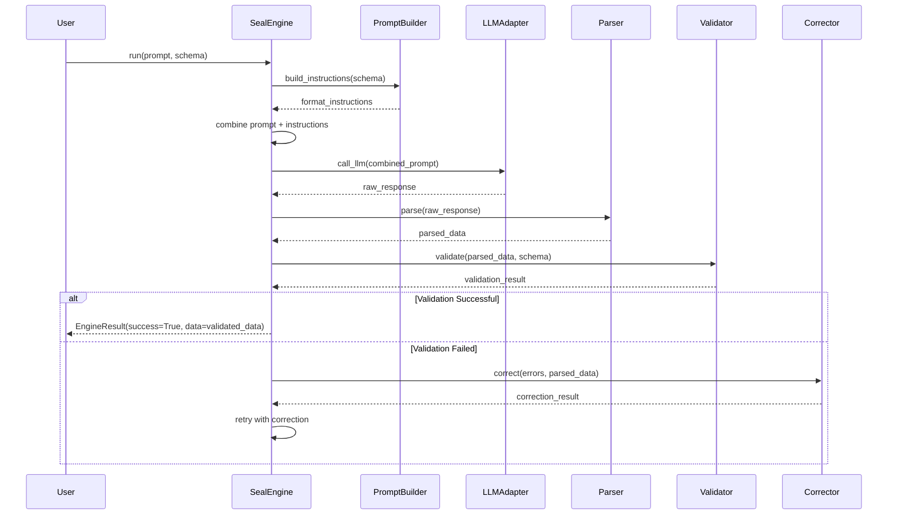
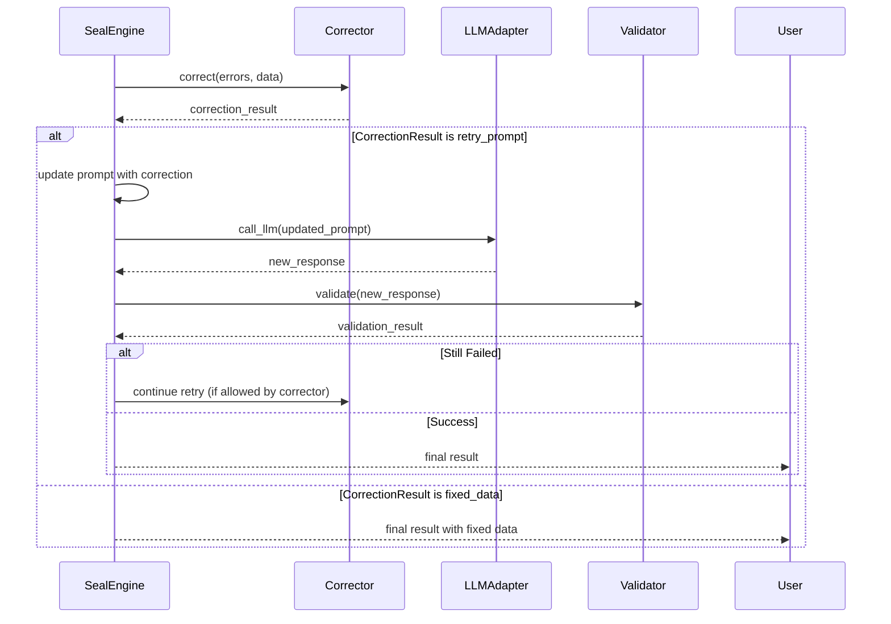

# SealEngine 模块设计文档

## 1. 功能描述

SealEngine 是 Seal 库的核心组件，负责协调整个结构化输出保证流程。它实现了全托管的 Active Engine 模式，将 Prompt 构建、LLM 调用、解析、验证和修正等环节串联起来，提供一站式的结构化输出解决方案。

### 核心功能
1. **流程编排**：自动执行 Prompt -> LLM -> Parse -> Validate -> Correct 循环
2. **组件协调**：协调必选的 Parser、Validator、Corrector 组件工作
3. **重试控制**：支持最大重试次数配置，避免无限循环
4. **结果聚合**：提供详细的执行结果，包括成功数据、错误信息和重试历史
5. **异步支持**：支持异步和同步两种调用方式
6. **依赖明确**：要求显式提供所有必需组件，确保配置一致性

### 核心价值
- 简化用户使用，提供开箱即用的结构化输出保证
- 自动处理重试逻辑，提高结构化输出的成功率
- 提供详细的执行日志和错误信息，便于调试和监控

## 2. 架构设计

### 2.1 模块关系
```
┌─────────────┐    ┌─────────────┐    ┌─────────────┐    ┌─────────────┐    ┌─────────────┐
│  Prompt     │ ──►│   LLM       │ ──►│   Parser    │ ──►│  Validator  │ ──►│  Corrector  │
│  Builder    │    │  Adapter    │    │             │    │             │    │             │
└─────────────┘    └─────────────┘    └─────────────┘    └─────────────┘    └─────────────┘
       │                                                          │                 │
       └──────────────────────────────────────────────────────────┼─────────────────┘
                                                                  │
                                                          ┌─────────────┐
                                                          │ SealEngine  │
                                                          │             │
                                                          │  Orchestrator│
                                                          └─────────────┘
```

### 2.2 核心组件

#### SealEngine (主引擎)
- 流程编排的核心类
- 管理重试循环和错误处理
- 提供同步和异步接口

#### EngineResult (执行结果)
- 封装修程执行的结果
- 包含成功数据、错误信息、重试历史等
- 提供状态检查和数据访问方法


## 3. 接口设计

### 3.1 seal.engine 模块结构

```
seal/codes/engine/
├── __init__.py          # 模块导出
├── base.py              # 抽象基类定义
├── seal_engine.py       # SealEngine 主实现
├── results.py           # 结果和错误处理
└── errors.py            # 错误定义
```

### 3.2 核心接口

#### SealEngine 类（泛型实现）
```python
class SealEngine(Generic[T]):
    """SealEngine orchestrates the entire structured output guarantee process."""
    
    def __init__(self, 
                 model: Type[T],
                 llm_adapter: LLMAdapter,
                 prompt_builder: PromptBuilder[T],
                 parser: JsonParser,
                 validator: Validator[T],
                 corrector: CorrectionStrategy[T]):
        """
        Initialize SealEngine with type-safe components.
        
        Args:
            model: The target SealModel type that all components should work with
            llm_adapter: LLM adapter for making API calls
            prompt_builder: PromptBuilder instance bound to the model type
            parser: JSON parser instance
            validator: Validator instance bound to the model type
            corrector: Correction strategy bound to the model type

        """
        pass
    
    async def run_async(self, 
                       prompt: str,
                       **kwargs) -> EngineResult:
        """
        Run the engine asynchronously.
        
        Args:
            prompt: User prompt to send to LLM
            **kwargs: Additional parameters for LLM call
            
        Returns:
            EngineResult containing the execution outcome
        """
        pass
    
    def run_sync(self, 
                prompt: str,
                **kwargs) -> EngineResult:
        """
        Run the engine synchronously.
        
        Args:
            prompt: User prompt to send to LLM
            **kwargs: Additional parameters for LLM call
            
        Returns:
            EngineResult containing the execution outcome
        """
        pass
```

#### EngineResult 类（泛型实现）
```python
@dataclass
class EngineResult(Generic[T]):
    """Result of SealEngine execution."""
    
    success: bool
    """Whether the execution was successful"""
    
    data: Optional[T] = None
    """Validated data if successful"""
    
    errors: List[ValidationError] = field(default_factory=list)
    """Validation errors if failed"""
    
    retry_count: int = 0
    """Number of retry attempts"""
    
    execution_log: List[ExecutionStep] = field(default_factory=list)
    """Detailed execution log for debugging"""
    
    final_prompt: Optional[str] = None
    """The final prompt used in the last attempt"""
    
    def get_data(self) -> Optional[T]:
        """Get the validated data if successful."""
        return self.data
```


## 4. 数据流设计

### 4.1 正常流程


### 4.2 重试流程


## 5. 错误处理设计

### 5.1 错误类型

#### EngineError (基础错误)
- 引擎执行过程中的通用错误

#### MaxRetriesExceededError
- 达到最大重试次数时的错误

#### LLMCallError
- LLM 调用失败时的错误

### 5.2 错误处理策略

1. **LLM 调用错误**：重试指定次数，然后抛出异常
2. **解析错误**：尝试自动修复，失败则生成修正提示
3. **验证错误**：根据配置的修正策略进行处理
4. **配置错误**：立即抛出异常，不进行重试


## 7. 性能考虑

### 7.1 异步支持
- 提供异步接口避免阻塞主线程
- 支持并发处理多个请求

### 7.2 缓存优化
- 缓存 PromptBuilder 的结果避免重复计算
- 缓存解析器的中间结果

### 7.3 内存管理
- 及时清理中间数据避免内存泄漏
- 限制重试循环中的内存使用

## 8. 测试策略

### 8.1 单元测试
- 测试各个组件的正确集成
- 测试重试逻辑的正确性
- 测试错误处理机制

### 8.2 集成测试
- 测试与真实 LLM 的集成
- 测试端到端的流程正确性

### 8.3 性能测试
- 测试引擎的响应时间
- 测试内存使用情况

## 9. 扩展性考虑

### 9.1 插件架构
- 支持自定义的修正策略
- 支持自定义的解析器
- 支持自定义的验证器

### 9.2 配置扩展
- 支持通过配置文件进行配置
- 支持动态配置更新

### 9.3 监控扩展
- 支持性能指标收集
- 支持执行日志导出